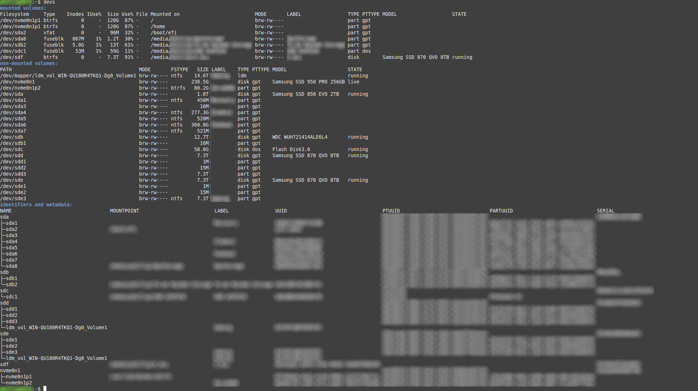
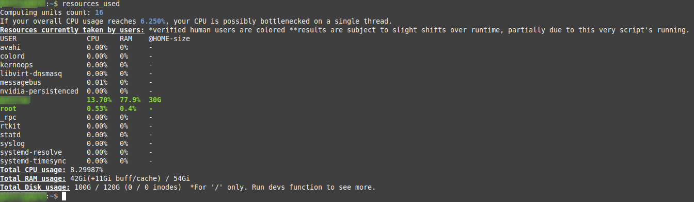
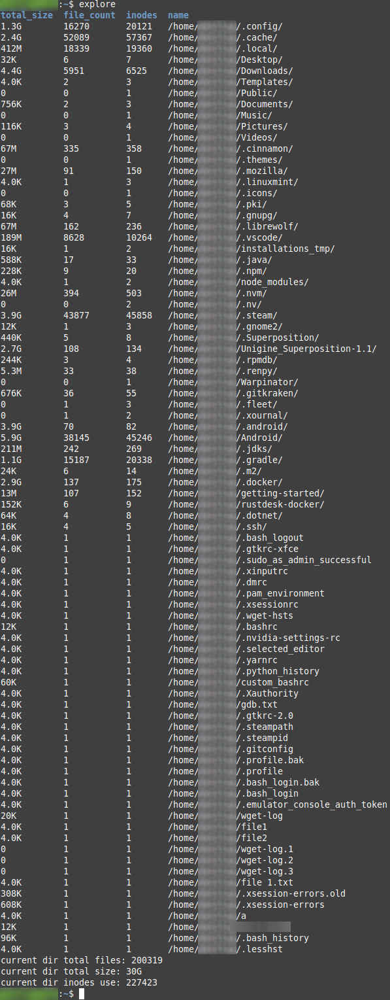
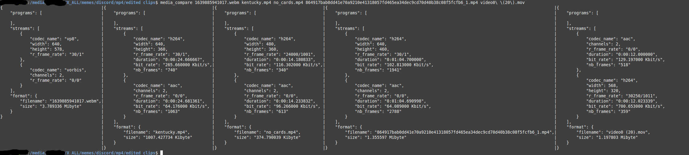
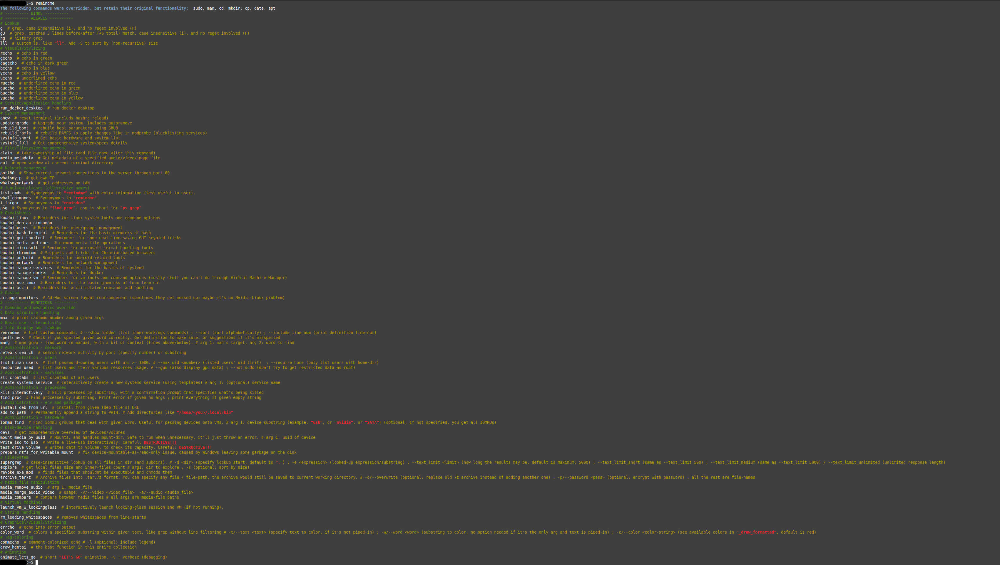

# linux_bashrc

## About

A bashrc file with various gimmicks I found or came up with

It's still a work in progress; some features are commented out until they'll be finished

### Guiding principles:

+ **Informative** functions should pack of as much *relevant* data into as few user requests as possible.
+ **Potentially-harmful** functions *always* require bold and clear messages that prompt the user for approval.
+ **Overridden** functionalities have the highest potential of improving the user-experience, thus they're fair-game.
  + Dare to replace basic functionalities with ones from better packages, or enforce the usage of 99%-necessary flags
    + The user doesn't need to be familiar with the alternatives packages or useful flags, just make the same-old commands better.
  + Include said replacements only if they're meaningfully-better.
  + It's fine to rely on specific packages.
    + It's up to the user to decide whether to install packages necessary for the bashrc functionality.
    + If some command doesn't work because of a missing package, the function should fail; not fix itself.
  + Damages due to common commands' override should always be unlikely, yet fully remain the user's responsibility
  + Don't rely on your overrides' quirks in your own functions; they're there for the user's convenience and should be considered removable.
+ Be considerate of the user: assume tiredness or weak memory.
  + If something complicated is going on, there should be a notification/explanation about it.
  + Don't let the text blend; color-code your messages, so it's easy to discern what kind of data is displayed.
  + Command names should be simple to understand, pronounce, and type.
    + Command names need to be different (at least start differently) than the system's. That way the user can tab-complete commands faster.
+ There shouldn't be 2 functions that do the same thing.
+ Extra comments are always fine
  + Complicated functions should have usage-example(s)
  + It's fine to leave TODOs within the bashrc file, it's a 1-file project.
  + It's fine to leave dead code commented out if you plan on using it later (but clean it up once you're really done)

## Compatibility

Some commands utilize packages which you may need to install

This bashrc was written for Linux Mint 21 / 21.1, but should work for the most part with any distro.

## Usage


### Sourcing:

The best way to use this project is to source the "custom_bashrc" file. It's the most modular approach; also arguably the easiest.

Simply download this project and **paste the following code at the end of your bashrc file**. Remember to edit it by specifying the "CUSTOM_BASHRC_FILE" path

Your personal bashrc should be "$HOME/.bashrc", but you can alternatively source for all users through the "/etc/bash.bashrc" file (requires sudo)

```
# source custom bashrc file (more modular than modifying the actual bashrc file)
CUSTOM_BASHRC_FILE="<path-to-project>/custom_bashrc"

if [ -f "$CUSTOM_BASHRC_FILE" ]; then source "$CUSTOM_BASHRC_FILE" 
else echo "couldn't find custom_bashrc file at \"$CUSTOM_BASHRC_FILE\" , fix the file's permission-modifiers or fix the sourcing at \"$(readlink -f -- "$BASH_SOURCE")\"";  # print faulty file-dir, and this (current) file's location
fi
```


### Sourcing extra scripts (commands that reference non-bash scripts)

No need to do anything.

There is another bashrc file in this project called "script_calls_bashrc", which dynamically adds aliases that refer to scripts in a nearby folder (you can add your own scripts there)

By default, custom_bashrc sources the scripts' bashrc-file by relative path. Just don't move custom_bashrc out of the project-folder.


### Using the custom_bashrc commands:

The sourced bashrc files print a message when they're done loading; the message suggests running a command that tells you where/how to begin usage.

User-specific settings can be set at the top of the file, in the appropriate "My settings" section.
Just look-up the variables' names within this same file, you'll see what they're used for.


## Use Cases (examples)

Many functions within this project were created for the purpose of easing and automating solutions of re-occuring problems.

### Here are a few examples (kept simple, no extra args specified):


###### Figure 1: "devs" - output of the command "devs"
A simple command that gives you all info about all devices at once.
* Verbose: Identify by name/address/size/ which device is mounted or needs more space or inodes cleanup
* Clean: No irrelevant "loop" drives listed, unavailable data of block devices isn't shown (no empty space), allowing for a relatively compact display
* Compatible: Data is separated into 3 categories in order to horizontally fit most displays
* Immediate: No need to run the same command twice just to assess both disk-space and inodes
* Sorted: Block-device data is aggregated where applicable to df (mounted devices') data, sparing you the need to cross table information
* Extra metadata: Identifiers are added, displayed separately to fit better on most screens

**CASE:** Your EC2 server ran out of space. It has several similarly-sized volumes, which complicates the issue even if you find which virtual device needs to be enlarged;
**SOLVED:** You have everything you need in this one command: 1) which device is full 2) what SERIAL/PTUUID it has; it will correspond to one of AWS's volumes' identifiers

**CASE:** You want to add one of your devices to fstab, and need to collect various bits of data for it;
**SOLVED:** Everything necessary is displayed: file-system, UUID (don't mount by name please), and permission modifiers



###### Figure 2: "resources_used" - resource utilization
An overview of users' resource utilization.
- Note: root is always suspected as a human-user
- Note: the user that runs this script is expected to have an extra core's worth of CPU-percentage attributed to him due to running this function while also taking the measurements.
- Note: you'll see 0/0 inodes if your file-system doesn't use any (BTRFS, in case of this image)

* Verbose: Data is varied, includes CPU, RAM, Disk-space and inodes usage. Should fit most resource-related issues that users experience.
* Immediate: Runs several commands, which you won't need to aggregate and cross-reference yourself.
* Not only for admins: Can be run by non-sudo users. Running without sudo permission just leaves others' home directories' sizes unknown.

**CASE:** A user complains that the server is slow;
**AIDED:** User's CPU (and RAM) usages are displayed. Single-thread max-percentage (out of all units) is calculated,
so you can see if said user might be experiencing issues due to single-threaded running. RAM (heap) limitation might also be a factor.

**CASE:** A user forgot to close his work-session, and so memory isn't being deallocated for other users;
**SOLVED:** A list of all users makes it easy to tell who should be asked about the termination of their (forgotten?) session

**CASE:** Disk utilization by users needs to be evaluated;
**SOLVED:** If run through sudo, the size for each user's home-dir is calculated and displayed



###### Figure 3: "explore" - detail of directory's disk utilization
Specifies disk utilization of all files and folders within a directory

* Verbose: Get everything relevant to the explored directory's impact on disk.
  * In-depth: Calculates folder sizes recursively, and adds a total for all files at the end.
* Immediate: Runs several commands, which you won't need to aggregate and cross-reference yourself.

**CASE:** The question "what's taking so much space / inodes?" arises;
**SOLVED:** Everything you'd want to know about it regarding given dir.
You might need to rerun the function in a subdirectory, as it purposely doesn't print all subdirs, to avoid cluttering the response.



###### Figure 4: "media_compare" - comparison between media files
Displays side-by-side comparison of media files (movies, pictures, music) metadata (dimensions, bit-size, frame rate etc.)

**CASE:** Data duplication in the form of similar-content files. You need to decide which file to keep
**SOLVED:** Get all the relevant info, in a layout that simplifies comparison. You can estimate which file is lower quality, or takes too much space.



###### Figure 5: "remindme" - see which commands the bashrc file offers
Lists the bash commands that this project provides - can be used for lookup, reading the short documentation, or as the command's name implies - a reminder


